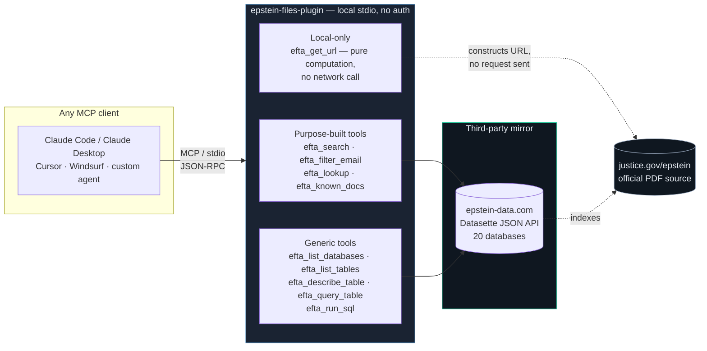

<div align="center">
  

  <br /><br />

  

  <br />

  <b>Epstein Files Plugin</b> — query the DOJ Epstein Files Transparency Act release from any AI agent

  <p align="center">
    <a href="#quickstart">Quickstart</a> ·
    <a href="#architecture">Architecture</a> ·
    <a href="#the-11-read-only-mcp-tools">Tools</a> ·
    <a href="#use-with-ai-agents">Use with AI Agents</a> ·
    <a href="#examples">Examples</a> ·
    <a href="#responsible-use">Responsible Use</a>
  </p>

  <a href="https://github.com/Zereo0317/Epstein-Files-Plugin/stargazers"></a>
  <a href="https://github.com/Zereo0317/Epstein-Files-Plugin/issues"></a>
  <a href="https://github.com/Zereo0317/Epstein-Files-Plugin/commits/main"></a>
  
  
  
  
  

  Turns a name, date, keyword, EFTA page number, or an open-ended question — about the email
  corpus, the photos, the transcripts, or the knowledge graph — into the exact, citable, official
  DOJ document. No hand-paging through ~2.8 million pages. No fighting DOJ's bot-blocked search.

</div>

> Operates only on already-public DOJ court records and a public full-text mirror. Built for
> research, fact-checking, and source-location — not re-identification, harassment, or doxxing.
> See [Responsible Use](#responsible-use).

---

## About

Epstein Files Plugin indexes and resolves documents in the public DOJ **Epstein Files Transparency
Act** release (Public Law 119-38, signed 2025-11-19) — roughly 1.4M documents / 2.8–2.9M pages
published across 12 DataSets at `justice.gov/epstein`, mirrored and indexed as **20 queryable
databases** by the third-party service epstein-data.com (both figures verified live 2026-08-24;
DOJ's total *collected* corpus is larger still, ~6M pages, of which this is the portion published
so far — re-verify before citing as exhaustive).

**Available as:**
- 🧩 a **Claude Code plugin** — installed from a marketplace in two lines
- 🔌 an **MCP server** ([`.mcp.json`](./.mcp.json)) — the same server, standalone — local stdio, no
  API keys, no remote host, works with any MCP-compatible client: Claude Desktop, Cursor,
  Windsurf, or a custom agent runtime built on the official `mcp` SDK
- 💻 a **Python CLI** — `python src/efta_researcher.py`, no MCP client required
- 📦 a **Python library** — `from efta_core import efta_to_url, get_dataset`, import directly

### Why use it:

- 🚀 **Faster than manual lookup.** DOJ's own search is blocked for automated/headless access
  (Akamai bot protection — see [Responsible Use](#responsible-use)); this goes straight from a
  name, date, or keyword to the matching EFTA number, in seconds.
- 🎯 **Direct-to-source, every time.** Every result resolves to the official `justice.gov/epstein`
  PDF URL — you verify the primary document yourself, never a paraphrase of it.
- ✅ **Fact-checked, not sensationalized.** The known-document registry ships with sourced
  fact-checks (EUvsDisinfo, Reuters, Tempo, and others) so a "connection" is labeled for what the
  document actually shows, not for what a viral caption claims.
- 🧠 **Completely queryable, not just the inbox.** Two purpose-built tools cover the email corpus;
  five generic tools reach all 20 databases — images, transcripts, OCR text, handwriting,
  depositions, the knowledge graph — plus a read-only SQL escape hatch for anything the filter API
  can't express.
- 🗺️ **Structure, reconstructed once.** The 12-DataSet / EFTA-Bates-number boundary table was
  cross-checked against DOJ's own disclosure pages, so you don't re-derive it per query.
- 🔓 **No lock-in.** The same lookups work from a CLI, a Python import, or any MCP client.

---

## Architecture



Two tool layers, deliberately: **purpose-built** wrappers over the single most common table (fast,
ergonomic, proper pagination), and a **generic** introspection/query/SQL layer that reaches every
other database without a dedicated tool per table — the answer to "can everything be queried," and
what keeps this working as epstein-data.com's schema evolves through 2031 without new code. See
[`CLAUDE.md`](./CLAUDE.md#architecture-purpose-built--generic-not-per-table-hardcoding) for the
full design rationale.

---

## I want to...

| Goal | Use this |
|---|---|
| Find a document by name, date, or keyword | [`efta_search`](#the-11-read-only-mcp-tools) / [`efta_filter_email`](#the-11-read-only-mcp-tools) |
| Turn a citation (`EFTA00741068`) into an official DOJ link | [`efta_get_url`](#the-11-read-only-mcp-tools) |
| Check whether a viral claim is real | [`efta_known_docs`](#the-11-read-only-mcp-tools) → [Research & Fact-Check Posture](#research--fact-check-posture) |
| Search images, transcripts, OCR text, or the knowledge graph | [`efta_list_databases`](#the-11-read-only-mcp-tools) → [`efta_query_table`](#the-11-read-only-mcp-tools) |
| Run a join, a count, or a `GROUP BY` | [`efta_run_sql`](#the-11-read-only-mcp-tools) |
| Wire this into an agent that isn't Claude Code | [Use with AI Agents](#use-with-ai-agents) |
| Understand the EFTA numbering / DataSet system | [DataSet Reference](#dataset-reference) |

---

## Quickstart

### Prerequisites
- Python 3.11 or later (3.10 reaches end-of-life 2026-10-31 — see [Tech stack currency](#tech-stack-currency-2026-08-24))
- pip

### Install as a Claude Code plugin

```
/plugin marketplace add Zereo0317/Epstein-Files-Plugin
/plugin install epstein-files-plugin@epstein-files-plugin
```

### Install for CLI / standalone MCP / library use

```bash
git clone https://github.com/Zereo0317/Epstein-Files-Plugin.git
cd Epstein-Files-Plugin
python -m pip install --upgrade pip
pip install -r requirements.txt   # requests, mcp (pinned <2.0 — see below)
```

### Run the CLI

```bash
python src/efta_researcher.py --list
python src/efta_researcher.py --search "trilateral commission"
python src/efta_researcher.py --sender epstein --recipient schank --date 2009-10-23
python src/efta_researcher.py --efta EFTA00741068
python src/efta_researcher.py --databases
python src/efta_researcher.py --tables image_analysis
python src/efta_researcher.py --sql "select dataset, count(*) as n from doc_search group by dataset" --database full_text_corpus
```

### Run the MCP server standalone

```bash
python src/mcp_server.py
```

---

## The 11 read-only MCP tools

**🔎 Purpose-built** (the common case — full-text + email metadata):

| Tool | Purpose |
|---|---|
| `efta_search(query, limit, cursor)` | Substring search across the Datasette index — true total match count + `cursor` paging |
| `efta_filter_email(sender, recipient, date_exact, date_prefix, subject, limit, cursor)` | Filter emails by metadata fields — same total-count + paging |
| `efta_known_docs(category)` | List pre-verified, fact-checked known documents |
| `efta_get_url(efta_number)` | Convert an EFTA number to its official DOJ PDF URL |
| `efta_verify_url(efta_number)` | HEAD-check whether a DOJ PDF URL is live (see caveat below) |
| `efta_lookup(efta_number)` | Full document metadata from the Datasette index |

**🧬 Generic** (every one of the 20 databases, no hardcoding per table):

| Tool | Purpose |
|---|---|
| `efta_list_databases()` | List all 20 Datasette databases (images, transcripts, OCR, depositions, ...) |
| `efta_list_tables(database)` | List every table in one database, with columns + row counts |
| `efta_describe_table(database, table)` | Column list + row count for one table |
| `efta_query_table(database, table, filters, limit, cursor)` | Filter-suffix query against **any** table |
| `efta_run_sql(database, sql, params, limit)` | Read-only SQL — joins, aggregation, `GROUP BY`; Datasette rejects any non-`SELECT` with HTTP 400 |

✅ All 11 tools are annotated `readOnlyHint`/`idempotentHint` (and `openWorldHint` on everything
network-facing) per the MCP tool-annotations convention — a client can safely auto-run them.

> ⚠️ **Pagination:** `limit` caps at 50–100 depending on the tool. A query can match far more (e.g.
> "pizza" currently matches 233 documents) — paged tools surface `(N of TOTAL shown)` and, when
> more exist, a `cursor` to continue.

> ⚠️ **URL verification:** justice.gov gates every PDF behind an age-verify + Akamai challenge, so
> a raw HTTP status can't reliably distinguish live from missing. URL correctness comes from the
> verified DataSet boundary table below, not from probing justice.gov.

> ❌ **Not covered by the purpose-built tools alone:** `image_analysis` (92K captioned images),
> `transcripts` (435 audio/video transcripts), `knowledge_graph`, `ocr_database`,
> `handwriting_transcriptions`, and 13 more — all reachable via the generic tools instead. Call
> `efta_list_databases()` for the live, current list rather than trusting this table.

---

## Use with AI Agents

Epstein Files Plugin is **MCP-first, not Claude-first**: a standard local stdio server (built on the
`FastMCP` class bundled inside the official `mcp` Python SDK) speaking plain Model Context
Protocol. It works with any MCP-compatible client.

| Client | How it connects |
|---|---|
| **Claude Code / Claude Desktop** | `/plugin marketplace add` + `/plugin install`, or the raw `.mcp.json` |
| **Cursor / Windsurf / Cline** | Add the server entry from `.mcp.json` to the client's MCP settings |
| **OpenClaw** | Add the same generic config below under `mcpServers` in your own `~/.openclaw/openclaw.json` (or `openclaw config set mcpServers.epstein-files-plugin.command "python"` etc.) — a local stdio server needs no `transport` field, OpenClaw auto-detects it from `command`. This plugin's own ClawHub listing manifest can't auto-wire this for you (OpenClaw's plugin manifest has no MCP-server field as of the current release — see [`CLAUDE.md`](./CLAUDE.md)); this per-user config is the real, working path. |
| **ChatGPT, Gemini, or any custom/headless agent** | Point it at `src/mcp_server.py` over stdio — no plugin system or Claude dependency required |

### Generic MCP client configuration
```json
{
  "mcpServers": {
    "epstein-files-plugin": {
      "command": "python",
      "args": ["/absolute/path/to/epstein-files-plugin/src/mcp_server.py"]
    }
  }
}
```
No API keys, no auth, no remote server — a local process talking stdio, identical behavior in
every client.

### Claude Code
Installed as a plugin, the same server auto-loads from this repo's `.mcp.json` (uses
`${CLAUDE_PLUGIN_ROOT}`, no path editing needed):
```json
{
  "mcpServers": {
    "epstein-files-plugin": {
      "command": "python",
      "args": ["${CLAUDE_PLUGIN_ROOT}/src/mcp_server.py"],
      "env": { "PYTHONUNBUFFERED": "1" }
    }
  }
}
```

### Environment overrides (resilience against a mirror or domain change)

| Variable | Default | Affects |
|---|---|---|
| `EFTA_DATASETTE_BASE_URL` | `https://epstein-data.com` | Every search/query/SQL tool |
| `EFTA_DOJ_BASE_URL` | `https://www.justice.gov` | `efta_get_url`, `efta_verify_url`, the CLI's `--download`/`--verify` |

A future change to either third-party host is a config change, not a code change.

---

## Examples

**Example 1 — Resolve a citation to its official source**

```
User request:  "What's the DOJ URL for EFTA00741068, and which DataSet is it in?"

Response:
  EFTA: EFTA00741068
  DataSet: DS9
  URL: https://www.justice.gov/epstein/files/DataSet%209/EFTA00741068.pdf

Under the hood:
  efta_get_url("EFTA00741068") parses the Bates number, resolves it against the verified
  12-DataSet boundary table, and constructs the official DOJ URL — no network call, no guessing.
```

**Example 2 — Find an email by sender, recipient, and date**

```
User request:  "Find the Epstein -> Roger Schank email from October 23, 2009."

Response:
  Found 3 email(s):
    EFTA00741068  DS9   2009-10-23  12:01:12   <- primary
    EFTA00885615  DS9   2009-10-23  12:01:12   (OCR duplicate, reads "grnail.com")
    EFTA01821140 DS10   2009-10-23  12:01:12   (third copy, later processing batch)

Under the hood:
  efta_filter_email(sender="epstein", recipient="schank", date_exact="2009-10-23") queries the
  epstein-data.com Datasette API (DOJ's own /multimedia-search is blocked for headless clients)
  and returns every metadata match, so duplicate copies can be cross-referenced by timestamp.
```

**Example 3 — Search beyond the email corpus (generic tools)**

```
User request:  "Any photos in the release that show a passport?"

Response:
  efta_list_tables("image_analysis") -> "images" table, 92,249 rows, column "analysis_text"
  efta_query_table("image_analysis", "images", filters={"analysis_text__contains": "passport"})
  -> matching rows with efta_number, source_pdf, and the analysis text itself

Under the hood:
  image_analysis isn't reachable through efta_search (that only covers full_text_corpus).
  efta_query_table works against any of the 20 databases using the same filter-suffix syntax,
  so no dedicated "image search" tool was needed.
```

**Example 4 — A question the filter API can't express (raw SQL)**

```
User request:  "Break down the document count by DataSet."

Response:
  efta_run_sql("full_text_corpus",
    "select dataset, count(*) as n from doc_search group by dataset order by dataset")
  -> 1:650, 2:150, 3:57, 4:143, 5:82, 6:13, 7:17, 8:10479, 9:480658, 10:496404,
     11:331597, 12:12339, 98:6, 99:23210   (live counts, 2026-08-24)

Note: two values (98, 99) fall outside the documented 1-12 DataSet scheme — small catch-all
buckets in the source data itself. efta_get_url()/get_dataset() only resolve DataSets 1-12.
```

---

## DataSet Reference

EFTA numbers are **page** (Bates) identifiers, not document identifiers — a 20-page PDF consumes
20 consecutive EFTA numbers. Boundaries below are the forensic per-file ranges from the
`rhowardstone/Epstein-research-data` mapping, cross-checked against DOJ's own disclosure pages.

| DataSet  | EFTA range              | Contents |
|----------|--------------------------|----------|
| DS01     | 1 – 3,158                | Photos, physical scans |
| DS02     | 3,159 – 3,857            | Photos, seized scans |
| DS03     | 3,858 – 5,586            | Grand jury exhibits |
| DS04     | 5,705 – 8,320            | Records, court filings |
| DS05     | 8,409 – 8,528            | Seized scans, depositions |
| DS06     | 8,529 – 8,998            | Depositions, indictments |
| DS07     | 9,016 – 9,664            | Transcripts |
| DS08     | 9,676 – 39,023           | Emails, police reports |
| **DS09** | **39,025 – 1,262,781**   | **Main email corpus** |
| DS10     | 1,262,782 – 2,205,654    | Emails, financial |
| DS11     | 2,205,655 – 2,730,264    | Emails, device data |
| DS12     | 2,730,265 – 2,858,497    | Court filings, FBI + expansion |

DOJ URL pattern: `https://www.justice.gov/epstein/files/DataSet%20{N}/EFTA{efta:08d}.pdf`

---

## Research & Fact-Check Posture

This release attracts conspiracy framings. Every entry in the known-document registry
(`efta_known_docs`) is confidence-tagged and de-sensationalized:

| Topic | What the documents show |
|---|---|
| Trilateral Commission / CFR | Epstein's own bio listed him as a *former member* — elite networking, not a plot |
| Rothschild | A real advisory relationship (~$25M Southern Trust agreement); the "Ukraine **upheaval**" email — EUvsDisinfo flagged the "coup" version as disinformation |
| Rockefeller | A Rockefeller University board seat + donor relationship — institutional, not "bloodline" |
| Illuminati | An **inbound**, unsolicited email sent *to* Epstein; no reply on record; not evidence of membership |
| Gates / BGC3 | A real pandemic-preparedness scope document; fact-checkers found no COVID-19 planning link |

---

## Responsible Use

- ✅ Operates **only** on already-public DOJ releases at `justice.gov/epstein` and a public
  third-party full-text mirror (epstein-data.com). No private data, no paywalled sources, no
  scraping behind a login.
- ✅ Every claim in the known-document registry carries a source and a confidence tag — a
  "connection" is labeled for what a document literally shows, never for what a viral caption
  claims.
- ✅ `efta_run_sql` broadens *what* can be queried, not the ethical posture: Datasette's own API
  only accepts `SELECT` (a non-`SELECT` is rejected with HTTP 400 before it reaches SQLite —
  verified live), and it reaches no data epstein-data.com doesn't already expose to anyone
  browsing its site directly.
- ❌ **Not for re-identification, harassment, or doxxing.** This is source-location and
  verification tooling, not an investigation or accusation engine — it does not allege wrongdoing
  beyond what a document shows.
- ❌ **Not legal advice, not an official DOJ product, and not affiliated with epstein-data.com** —
  an independent client of their public API.

---

## Tech stack currency (2026-08-24)

- **Python:** 3.11+ required (bumped from 3.10 — EOL 2026-10-31). Tested against 3.14.7.
- **MCP SDK:** pinned `mcp>=1.29.0,<2.0.0`. The official SDK's v2.0.0 (2026-07-28) renamed
  `mcp.server.fastmcp.FastMCP` to `mcp.server.mcpserver.MCPServer` — a breaking change this server
  hasn't migrated to. An unpinned `mcp>=1.0.0` would silently resolve to v2.x and fail to import.
  The unrelated standalone `fastmcp` PyPI package (PrefectHQ, now v3.x/4.0) is not a dependency.
- **pip:** install command above runs `python -m pip install --upgrade pip` first.
- **requests:** `>=2.31.0`, no known constraint against newer 2.x releases.

---

## Project Layout

```
.claude-plugin/plugin.json   Plugin manifest (Claude Code convenience only)
.mcp.json                    Local stdio MCP server config (client-agnostic)
src/efta_core.py             DataSet boundary table, EFTA -> URL, known-document registry
src/epstein_datasette.py     epstein-data.com Datasette API client (purpose-built + generic layer)
src/doj_auth.py              justice.gov public anti-bot challenge helper + verification
src/efta_researcher.py       Standalone CLI
src/mcp_server.py            FastMCP server exposing the 11 tools above
skills/efta-research/        Claude Code skill: research methodology (optional convenience)
skills/doj-auth/             Claude Code skill: justice.gov access details (optional convenience)
```

---

## Community & Support

### Contributing
This is a public, single-maintainer research tool (`Zereo0317/Epstein-Files-Plugin`). Issues and
pull requests are welcome.

### License
**MIT-0** (MIT No Attribution) — see [`LICENSE`](./LICENSE). Chosen over plain MIT specifically for
ClawHub compatibility, which requires MIT-0 with no per-skill overrides. The repository is public
on GitHub; the license grant governs redistribution/reuse of the code by anyone.

### Disclaimer
Epstein Files Plugin only surfaces documents the DOJ has already made public under the Epstein Files
Transparency Act, plus a public third-party full-text mirror (epstein-data.com) of that same
release. It resolves citations to their official source and reports what a document literally
contains — it does not conduct original investigation, does not allege wrongdoing beyond what a
document shows, and does not host, re-host, or expose any non-public data. Intended for research,
fact-checking, and source verification — not re-identification, harassment, or doxxing.
